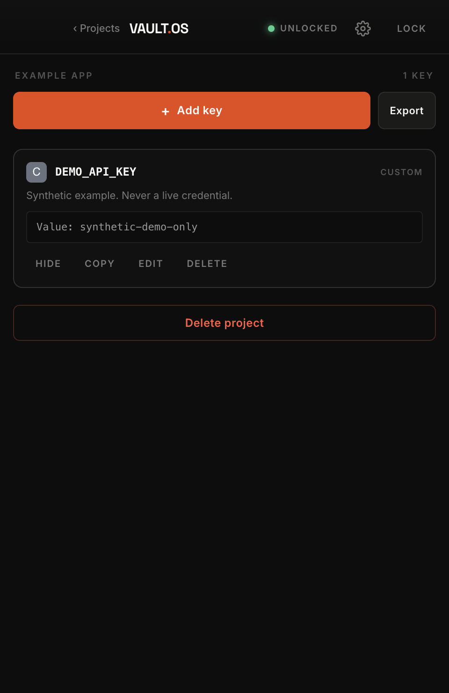

# VaultOS

**Your project secrets, on your Mac. Give coding agents the access they need.**

VaultOS is a local desktop vault with an MCP bridge. Organize credentials by project, approve an agent's projects and output folders, and let it write a working environment file without returning the secret values in its tool response.

[Download the macOS preview](https://github.com/rohit3a/vaultos/releases) · [Agent setup](docs/AGENTS.md) · [Security model](SECURITY.md) · [Contribute](CONTRIBUTING.md)

> **Unsigned preview:** early software for evaluation, without Developer ID signing or Apple notarization. Start with test credentials and keep independent backups. Security regression tests are included; this project has not received an independent security audit.



## Why use it?

- **Fewer secrets in chat.** `inject_secrets` writes approved keys to an approved file; its response contains names and counts, not values. Revealing a value requires a separate, off-by-default permission.
- **A human controls access.** Enroll and revoke individual agents. Choose their projects, output directories, and scopes. Agents cannot widen their own permissions.
- **Protect existing credentials.** Human-owned entries require explicit delegation before an agent can edit them. Agent-created credentials start awaiting approval for injection.
- **Local by default.** No account, hosted vault service, telemetry, or automatic cloud upload. Password remembering is optional and uses macOS Keychain without a plaintext fallback.
- **Practical daily tools.** Searchable project records, expiry metadata, short-lived clipboard copies, encrypted PDF export, password rotation, encrypted backups, and guarded undo.
- **Optional encrypted sync.** Use a separate Git repository with age encryption, pinned peer signing identities, tamper checks, and explicit conflict acceptance.

Injection reduces accidental disclosure in tool transcripts. **It does not stop an agent with filesystem or shell access from reading the resulting file.** VaultOS is not an operating-system sandbox or an enterprise access-control service. Read the [threat model](SECURITY.md) before deciding what to store.

## Install on macOS

1. Download the ZIP and matching `.sha256` from the [preview release](https://github.com/rohit3a/vaultos/releases). Choose `arm64` for Apple Silicon or `x64` for Intel. The deployment target is macOS 13 or later; see release notes for versions actually tested.
2. In the download folder, run `shasum -a 256 -c <download-name>.zip.sha256` and confirm `OK`. This checks file integrity; it does not authenticate a publisher independently of GitHub.
3. Extract **VaultOS Preview.app** and put it in a folder of your choice. It can coexist with other vault applications.
4. Try opening it. If macOS blocks the unidentified developer, follow Apple's [per-app Open Anyway instructions](https://support.apple.com/en-us/102445) in **System Settings → Privacy & Security**, only after you have verified and decided to trust the download. Managed Macs may disallow this. Do not disable Gatekeeper globally.
5. Create a new vault using a unique passphrase of at least 12 characters. There is no password reset or recovery service.

The desktop download includes its runtime. Node.js is needed only for source development, the MCP bridge, and the recovery CLI. Git and age are needed only for optional sync.

### First five minutes

Create an **Example App** project and add a disposable credential. In **Settings → Agents**, enroll your coding tool with `read` and `inject`, select that project, and approve its project folder. Save the one-time token in a private file and follow [MCP setup](docs/AGENTS.md). Ask the agent to inject the chosen key into that folder's `.env`; check the application works without asking it to print the file.

Use **Lock** when finished. While the desktop is running, Lock, system sleep, screen lock, or 15 minutes without a privileged desktop action stop the local API and clear the decrypted application state. Closing the app also stops its API. If you explicitly enabled background Keychain access, the bridge can start a separate backend after the app closes. Manual lock blocks that until a human unlocks again. The separate headless backend does not monitor screen-lock events; disable background access or use Lock before closing if you need that boundary.

## Storage and recovery

Preview data lives in `~/Library/Application Support/VaultOS-Preview`, with a separate `org.vaultos.preview` Keychain namespace. It does not automatically import older applications' data, tokens, sync repositories, or Keychain entries. `VAULTOS_DATA_DIR` can select an **absolute, new directory** for testing.

Back up `vault.enc` and remember its password. Optional sync has separate machine keys and trust state. Read [backup, recovery, migration, and uninstall](docs/RECOVERY.md) before using real credentials.

## Run from source

Use Node.js 22 or later, npm, and macOS command-line developer tools for the native helper:

```sh
git clone https://github.com/rohit3a/vaultos.git
cd vaultos
npm ci
npm run build:native
npm start
```

The desktop release targets macOS. Core tests can also run on Linux. To include the optional sync tests, install `age` (`brew install age` on macOS, or your distribution's package). Tests use temporary synthetic vaults.

```sh
npm run check
npm run test:ui          # macOS with an interactive desktop
npm run dist:mac         # unsigned preview for this Mac's architecture
VAULTOS_ARCH=x64 npm run dist:mac
```

See [development and release instructions](CONTRIBUTING.md), [architecture](docs/ARCHITECTURE.md), and [optional sync](docs/SYNC.md).

## Project status

This first public preview prioritizes a small, inspectable local workflow. Remaining release milestones include independent security review, Developer ID signing and notarization, broader macOS/Intel runtime coverage, accessibility review, and usability improvements to conflict resolution. No automatic updater is enabled; install future releases explicitly after backing up.

Built and maintained by [@rohit3a](https://github.com/rohit3a). Contributions, reproducible bug reports using synthetic data, and security review are welcome. Licensed under [MIT](LICENSE); bundled fonts and dependencies retain their own licenses.
